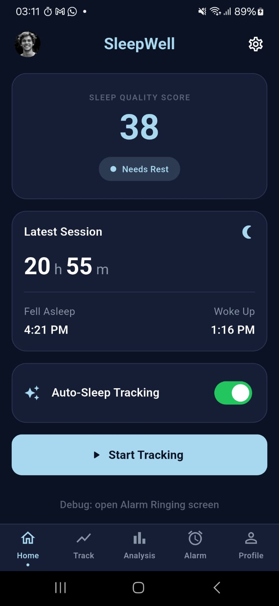
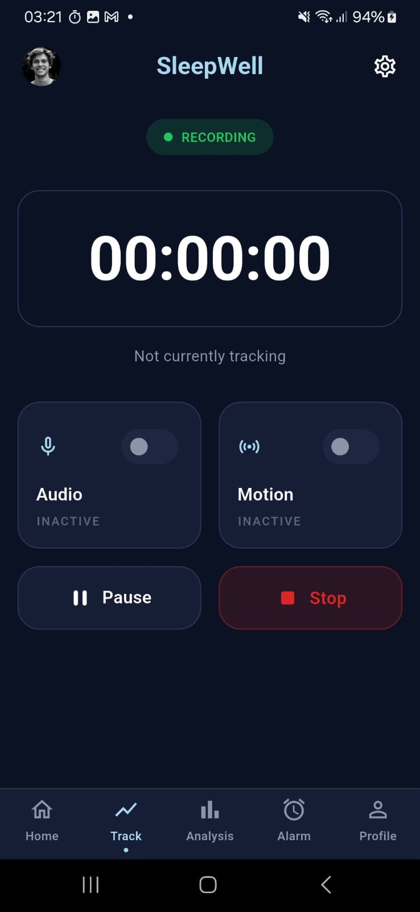
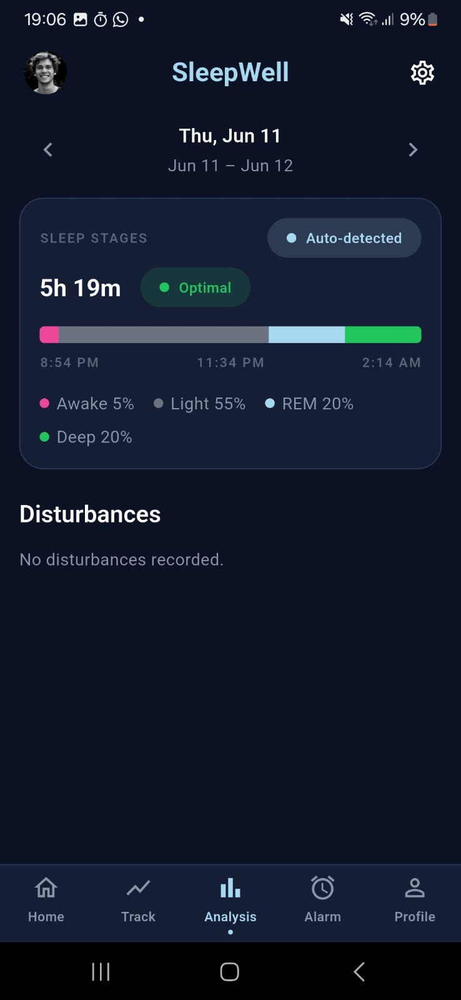
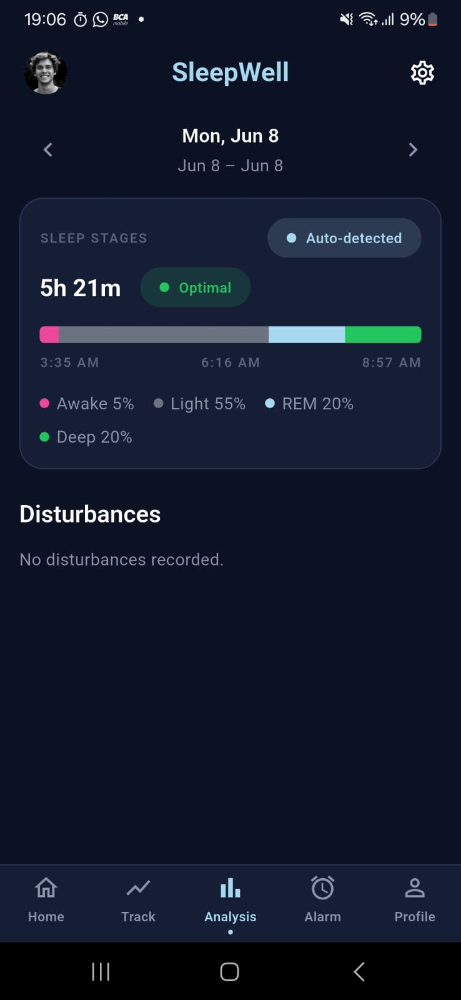
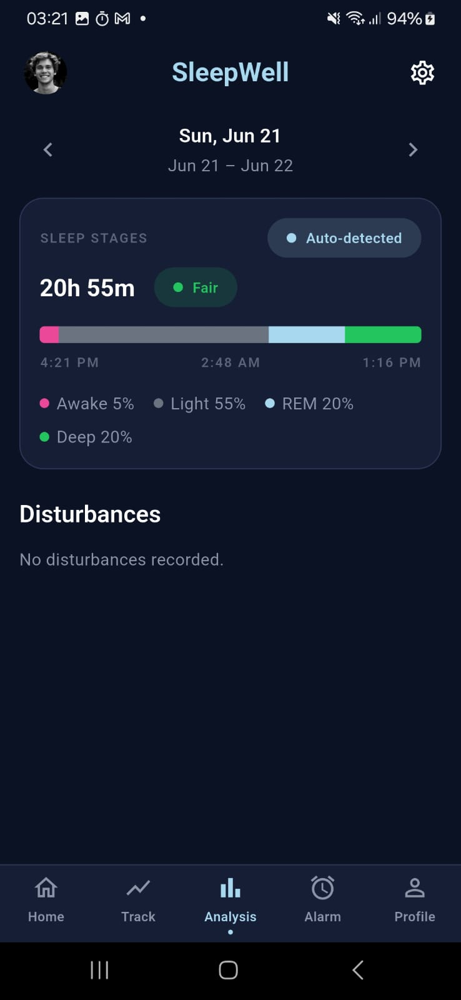
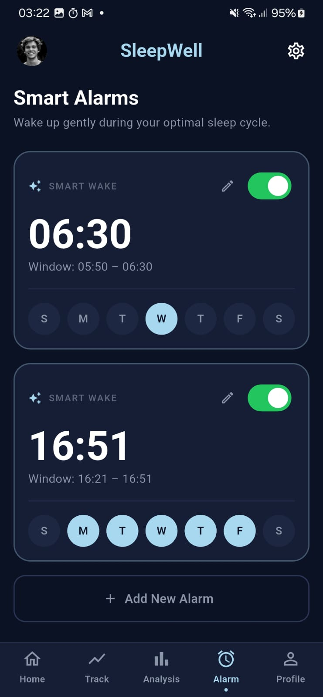
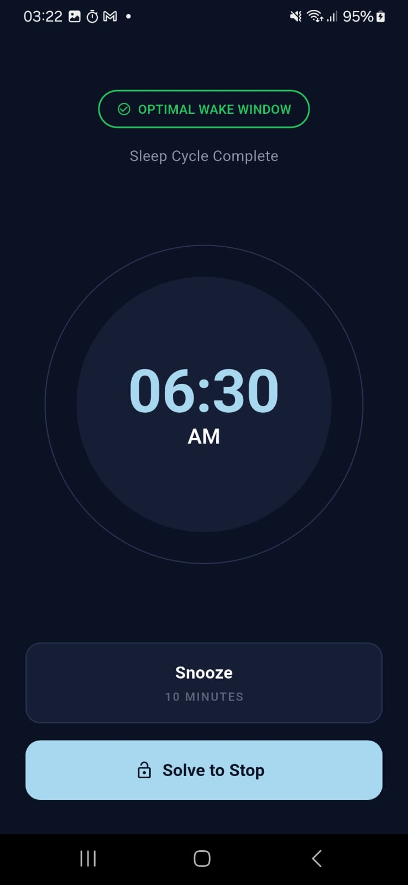
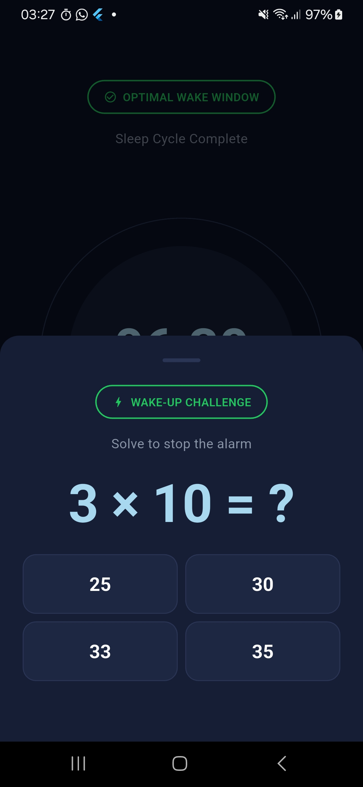
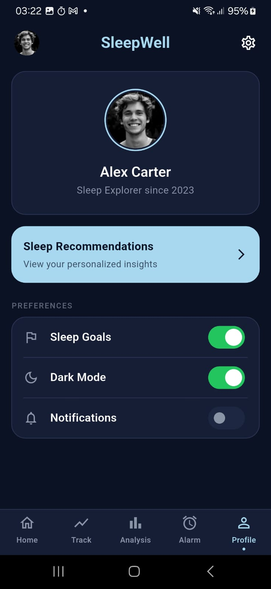

# SleepWell — Smart Sleep Tracking App

SleepWell is a Flutter app we built for our **Interaksi Manusia & Komputer (IMK / Human–Computer Interaction)** course. The idea is simple: track how you sleep, tell you honestly how good (or bad) that night was, and then actually get you out of bed in the morning — with an alarm you can't dismiss while half-asleep, because you have to solve a little math puzzle first.

## Team Members (Kelompok)

| NRP | Nama |
| --- | --- |
| 5025231005 | Muiz Surya Fata |
| 5025231008 | Alfa Radhitya Fanany |
| 5025231163 | Muhammad Thariq Darobi |

## Table of Contents

1. [What We Built](#what-we-built)
2. [Screen by Screen](#screen-by-screen)
3. [Features](#features)
4. [How the Logic Works](#how-the-logic-works)
5. [How We Structured the Code](#how-we-structured-the-code)
6. [Data Model](#data-model)
7. [Tech Stack](#tech-stack)
8. [Permissions](#permissions)
9. [Running It Yourself](#running-it-yourself)
10. [Testing](#testing)
11. [Why We Made These Design Choices](#why-we-made-these-design-choices)
12. [What's Still Missing](#whats-still-missing)

## What We Built

We wanted SleepWell to do two things well. First, understand your sleep: you can either start a session yourself before bed, or let the app quietly figure it out on its own from how long your phone sat idle overnight. Either way you end up with a **Sleep Quality Score** from 0 to 100, a colour-coded breakdown of your sleep stages, and a list of anything that disturbed you during the night.

Second, wake you up properly. We added a **Smart Alarm** that goes off inside a wake window you choose, and a **Wake-Up Challenge** — a small arithmetic puzzle you have to get right before the alarm shuts up. We kept running into the problem of swiping our own alarms off in our sleep, so this was our fix for it.

One thing we cared about from the start: everything stays on the phone. There's no account and no server. Even the microphone is only ever read as a loudness number — we throw the actual audio away and never save or send it anywhere.

The whole app lives behind five tabs at the bottom — Home, Track, Analysis, Alarm, and Profile — plus a separate full-screen alarm page that takes over when an alarm fires.

## Screen by Screen

### 1. Home (Dashboard) — `/`
This is where you land. It shows your most recent **Sleep Quality Score** with a plain-language label (Needs Rest, Fair Recovery, Good Recovery, Excellent Recovery), a quick summary of your last session, the **Auto-Sleep Tracking** switch, and a big **Start Tracking** button for when you want to record a session manually.



### 2. Track — `/track`
The live screen while a manual session is running. There's a **RECORDING / PAUSED** pill, a running timer, and two sensor cards you can flip on independently — **Audio** (the mic, for picking up noise) and **Motion** (the accelerometer, for catching restless movement). **Pause** and **Stop** are there too; stopping saves the session.



### 3. Analysis — `/analysis`
Here you look back at one night at a time, stepping between dates with the arrows. The **Sleep Stages** card gives you the total duration, an Optimal/Fair tag, the stacked stage bar (Awake / Light / REM / Deep) with start, middle and end times, and a legend with the percentages. Nights the app figured out on its own get an **Auto-detected** pill. Underneath, the **Disturbances** section lists any noise or movement we caught — or just says nothing happened.

<table>
  <tr>
    <td></td>
    <td></td>
    <td></td>
  </tr>
</table>

### 4. Alarm (Smart Alarms) — `/alarms`
Where you set up your alarms. Each card shows the wake time, the wake window (for example `Window: 05:50 – 06:30`), an on/off switch, an edit button, and a row of weekday toggles. We support two kinds: **Smart Wake**, which fires at the start of the window, and **Standard**, which fires at the exact time. The button at the bottom adds a new one.



### 5. Alarm Ringing — `/alarm-ringing` (full screen)
When an alarm goes off this takes over the whole screen. You get the **Optimal Wake Window — Sleep Cycle Complete** banner, the time in a big ring, a **Snooze (10 minutes)** option, and the **Solve to Stop** button. The sound keeps looping until you deal with it.



### 6. Wake-Up Challenge (the puzzle)
Hit **Solve to Stop** and this sheet slides up. The math equation on screen is **the puzzle** — a random arithmetic problem (like `3 × 10 = ?`) with four choices. The alarm only stops once you tap the right answer; tap a wrong one and you get a fresh problem instead. The point is that you can't just mash a button to make it stop — you have to wake up enough to actually do the sum.



### 7. Profile & Settings — `/profile`
Your profile (for now this is a placeholder, since we didn't add login in this phase), a **Sleep Recommendations** shortcut, and the **Preferences** switches: Sleep Goals, Dark Mode, and Notifications.



## Features

- **Manual sleep tracking** — start a session before bed, optionally with the mic and accelerometer on. A foreground service keeps it running while the phone is asleep.
- **Auto-sleep detection** — we infer your sleep window from how long the phone was idle (using Android's Usage Access), so there's no extra battery cost from sensors. Anything detected this way is labelled clearly.
- **Sleep Quality Score** — a single 0–100 number built from how much you were awake, how many disturbances there were, and how far off 8 hours you slept.
- **Sleep-stage view** — a stacked Awake / Light / REM / Deep bar with percentages and the night's time range.
- **Disturbance detection** — sustained loud noises (from the mic's loudness) and restless movement (from accelerometer shakiness), cleaned up so you don't get spammed with duplicates.
- **Smart Alarms** — per-day alarms that wake you at the start of your window, and that survive a reboot because we re-schedule them.
- **Wake-Up Challenge** — the math-puzzle gate that stops you dismissing the alarm while still asleep.
- **Offline and private** — everything is stored locally; the audio is loudness-only and never leaves the phone.
- **Crash recovery** — if the app gets killed mid-session, we notice the leftover on the next launch and let you save or throw it away.

## How the Logic Works

We deliberately kept the tricky logic (scoring, scheduling, detection, debouncing) as plain Dart with no Flutter or database mixed in, so we could unit-test it on its own.

### Sleep Quality Score — [`lib/services/scoring.dart`](lib/services/scoring.dart)
We start at 100 and subtract penalties, then clamp the result to 0–100:

```
qualityScore = 100
  − (awakePercent        × 2)
  − (disturbanceCount    × 3)
  − (|durationHours − 8| × 4)     // how far from an ideal 8-hour night
```

For example, the 20h 55m night in the screenshots gets hit hard for being ~13 hours off the 8-hour target, which is why it lands at **38 (Needs Rest)**.

### Auto-Detection — [`idle_window_detector.dart`](lib/services/idle_window_detector.dart) + [`auto_tracking_service.dart`](lib/services/auto_tracking_service.dart)
We run this once when the app launches and then hourly while it's open (no background daemon — we kept it deliberately simple):

1. Pull the last 24 hours of app-usage intervals (this needs Usage Access).
2. Merge the active stretches together, then look for the **longest idle gap** that lasts at least 4 hours and whose midpoint falls between **22:00 and 09:00**, so daytime naps don't count.
3. Save that as an auto session — but we never overwrite a manual one (those are more trustworthy), and we only replace an existing auto session if the new window is clearly longer.

### Smart Alarm Scheduling — [`alarm_scheduling.dart`](lib/services/alarm_scheduling.dart) + [`alarm_service.dart`](lib/services/alarm_service.dart)
- Smart alarms fire at the **start** of the wake window (`time − windowMinutes`); standard alarms fire right on `time`.
- Whenever something changes (and on launch, and after a reboot), we cancel everything and re-schedule the next **7 days** of alarms as exact `AndroidAlarmManager` one-shots.
- Snooze just re-schedules the alarm **10 minutes** later in its own slot.

### Disturbance Detection — [`manual_tracking_service.dart`](lib/services/manual_tracking_service.dart) + [`disturbance_debouncer.dart`](lib/services/disturbance_debouncer.dart)
- **Noise:** loudness above `−20 dBFS` held for at least 2 seconds counts as a noise event.
- **Motion:** when the accelerometer's shakiness over a ~10-second window crosses a threshold, that's a movement event.
- A **debouncer** then collapses the raw stream down to at most one event per type every 30 seconds, keeping the strongest one — otherwise a single noisy moment would log a dozen times.

### Wake-Up Challenge — [`alarm_ringing_screen.dart`](lib/screens/alarm_ringing_screen.dart)
We generate a random `+`, `−`, or `×` problem with small, friendly numbers and four unique choices. The sheet can't be swiped away, a wrong answer buzzes and swaps in a new problem, and only the correct answer closes it and stops the alarm.

## How We Structured the Code

We went with **Riverpod** for state and **go_router** for navigation, and kept the pure logic separate from anything Flutter- or Hive-specific so it stays testable.

```
lib/
├── main.dart                 # App bootstrap: storage init, alarm/notification setup, auto-detect timer
├── routes/
│   └── app_router.dart       # go_router: 5-tab StatefulShellRoute + full-screen /alarm-ringing
├── screens/                  # One file per screen (Dashboard, Track, Analysis, Alarms, Profile, AlarmRinging)
├── widgets/                  # Reusable UI (bottom nav, app bar, surface card, pill badge, day selector, alarm edit sheet)
├── state/                    # Riverpod controllers & providers (tracking, alarms, preferences, sessions)
├── services/                 # Business logic — scoring, scheduling, detection, tracking, notifications, formatting
├── data/                     # Persistence layer (Hive boxes, repositories, SharedPreferences bootstrap)
├── models/                   # Data classes + Hive TypeAdapters
└── theme/                    # Colors, text styles, spacing, ThemeData
```

The flow runs top to bottom: `screens` → `state` (Riverpod) → `services` (logic) → `data` (repositories) → Hive / SharedPreferences. We kept the platform plugins (mic, sensors, alarms) only inside `services`, so the state controllers stay pure Dart.

## Data Model

| Model | Hive `typeId` | What it holds |
| --- | --- | --- |
| `SleepStageBreakdown` | 0 | Awake / Light / REM / Deep percentages |
| `Disturbance` | 1 | One noise/movement event (type, timestamp, description, intensity) |
| `SleepSession` | 3 | A whole night: times, duration, score, stages, disturbances, source (`manual`/`auto`) |
| `AlarmConfig` | 5 | An alarm: type (`smart`/`standard`), time, label, window, active days, enabled |

- A `SleepSession` with no `endedAt` is one we treat as *orphaned* (the app got killed mid-session) and recover on the next launch.
- In `AlarmConfig`, `time` is stored as minutes since midnight, and `activeDays` is a 7-item list running Sun..Sat.
- The simple preferences (auto-tracking, sleep goals, dark mode, notifications) live in **SharedPreferences** instead of Hive.

## Tech Stack

- **Framework:** Flutter (Dart SDK `^3.12.0`)
- **State management:** `flutter_riverpod`
- **Navigation:** `go_router`
- **Local storage:** `hive` / `hive_flutter` + `shared_preferences`
- **Alarms & background:** `android_alarm_manager_plus`, `flutter_local_notifications`, `flutter_foreground_task`, `android_intent_plus`
- **Sensors & capture:** `record` (audio loudness), `sensors_plus` (accelerometer), `app_usage` (idle detection)
- **Audio playback:** `audioplayers`
- **Utilities:** `permission_handler`, `intl`, `uuid`

## Permissions

These are the Android permissions we ask for, and why we need each one:

| Permission | Why we need it |
| --- | --- |
| `RECORD_AUDIO` + `FOREGROUND_SERVICE_MICROPHONE` | Noise detection (loudness only) |
| `ACTIVITY_RECOGNITION` | Restless-movement detection |
| `PACKAGE_USAGE_STATS` | Auto-detecting sleep from phone-idle time (the special "Usage access") |
| `SCHEDULE_EXACT_ALARM` / `USE_EXACT_ALARM` | Firing alarms at the exact time |
| `USE_FULL_SCREEN_INTENT` + `POST_NOTIFICATIONS` | The full-screen alarm notification |
| `WAKE_LOCK` / `VIBRATE` | Waking the device and the haptic buzz during the alarm |
| `RECEIVE_BOOT_COMPLETED` | Re-scheduling alarms after a reboot |
| `FOREGROUND_SERVICE` / `FOREGROUND_SERVICE_DATA_SYNC` | Keeping a manual session alive while you sleep |

A note on privacy: we read the mic for **loudness only**. The raw audio is drained and dropped on the spot — never stored, never sent.

## Running It Yourself

You'll need the [Flutter SDK](https://docs.flutter.dev/get-started/install) (Dart `^3.12.0`) and an Android device or emulator. Android is our main target — the alarm, usage-access, and foreground-service features are Android-specific.

```bash
# Grab the dependencies
flutter pub get

# Run it on a connected device or emulator
flutter run
```

To build a release APK:

```bash
flutter build apk --release
```

On the first launch, you'll be asked to grant Usage Access (for auto-detection) and the mic/activity permissions (for manual tracking).

## Testing

We covered the pure logic with unit tests under [`test/`](test/):

```bash
flutter test
```

| Test | What it checks |
| --- | --- |
| `scoring_test.dart` | The quality-score math and the stage stubs |
| `alarm_scheduling_test.dart` | Next-fire-time math across day and week boundaries |
| `idle_window_detector_test.dart` | Idle-window detection and the overnight filter |
| `disturbance_debouncer_test.dart` | Debouncing, and the strongest event winning |

## Why We Made These Design Choices

Since this is an HCI course, a lot of our decisions came down to making the app forgiving and easy to read at 3 a.m. A few we're happy with:

- We made the wake-up puzzle **multiple-choice** rather than asking you to type the answer — picking a number is much easier than recalling one when you're groggy.
- We tried to never punish a slip. A wrong puzzle answer just gives you a new one, and a session that got interrupted asks whether you want to keep or discard it instead of vanishing.
- We lean on **status pills** (RECORDING/PAUSED, Auto-detected, Optimal/Fair/Needs Rest) so you always know what the app is doing at a glance.
- The sleep stages use familiar colours and everyday words, and times show up in plain 12-hour format.
- Pretty much everything — alarms, each sensor, each preference — is its own toggle, so you stay in control, and tapping a tab you're already on takes you back to its start.
- We kept one **dark theme** with shared spacing and colour tokens and reused the same card and badge widgets everywhere, partly for consistency and partly because a dim, low-glare screen is just kinder to look at before bed.

## What's Still Missing

We want to be honest about the rough edges:

- **The stage breakdown is a stub.** Real per-minute stage detection was out of scope, so manual sessions use a baseline nudged by disturbances and auto sessions use a flat estimate — that's exactly what the "Auto-detected" label is warning you about.
- **Smart alarms fire at the start of the window** rather than checking your live sleep stage to pick the lightest moment, because that data isn't available inside the alarm's background isolate yet.
- **Auto-detection can't really tell** sleeping apart from a phone left idle on the nightstand.
- **It's Android-first.** Alarms, usage-access detection, and foreground services are all Android-specific, so iOS is only partially there.
- **There's no login yet.** The profile (avatar, name, year) is placeholder data — but all the actual sleep, alarm, and preference data is real and saved on the device.

---

<div align="center">
<sub>Made with Flutter for our Interaksi Manusia & Komputer (IMK) course.</sub>
</div>
